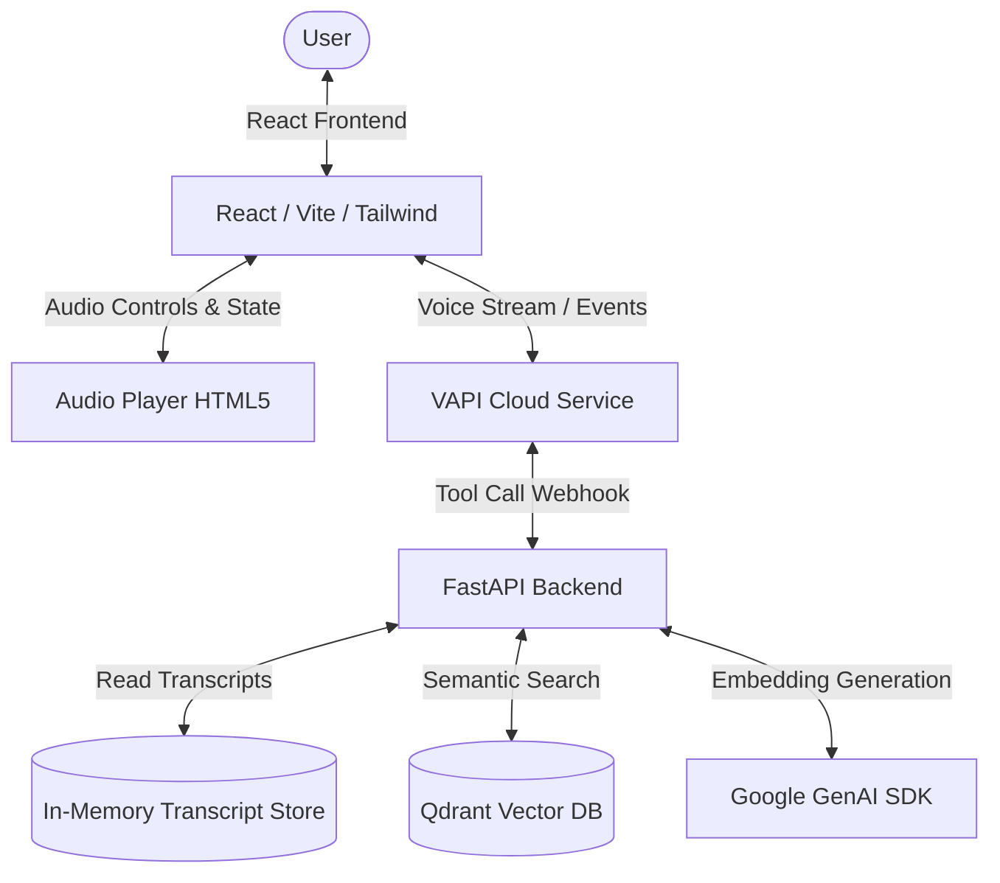
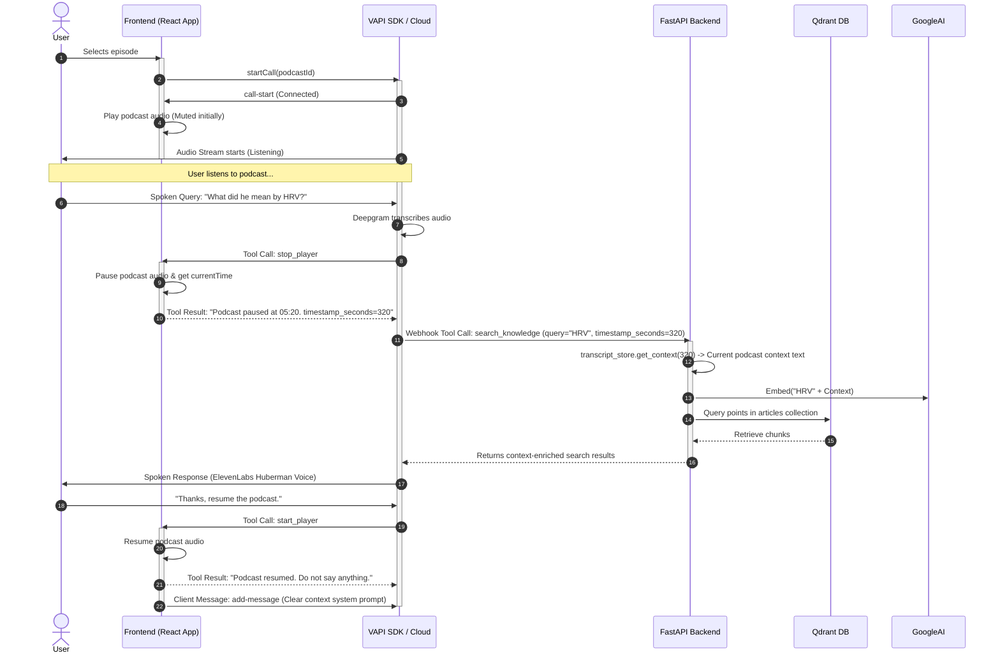

# Echo Project Analysis

This document provides a detailed breakdown of the architecture, data ingestion, retrieval pipelines, and interactive voice assistant workflow for the **Echo** AI-Powered Podcast Assistant project.

---

## 🏛️ Architecture Overview

Echo is built with a hybrid local-and-cloud architecture to support responsive podcast listening and voice-based question answering.



### 1. Technology Stack
* **Frontend:** React 19, TypeScript, Tailwind CSS v4, Vite, `@tanstack/react-query`, and VAPI Web SDK.
* **Backend:** Python 3.12, FastAPI, Pydantic, HTTPX.
* **Database:** Qdrant (Vector Database running in Docker).
* **AI Providers:**
  * **Transcriber:** Deepgram (`nova-2` model for speech-to-text).
  * **Voice Agent Coordinator:** VAPI (manages audio orchestration, state, and tool calls).
  * **LLM Engine:** Google Gemini (`gemini-3-flash-preview` on VAPI).
  * **Embedding Model:** Google GenAI SDK (`gemini-embedding-001` or `text-embedding-004`).
  * **Voice Synthesis:** ElevenLabs (`Andrew Huberman` custom voice clone).

---

## 🧠 Retrieval-Augmented Generation (RAG) Architecture

Echo uses a dual-index semantic search system to combine structured podcast transcripts with the academic articles mentioned in the episodes.

```mermaid
flowchart TD
    subgraph Ingestion Pipeline (ingest.py)
        A[Academic Articles .md / .txt] --> B[Article Chunking: chunk_article]
        C[Transcripts .txt] --> D[TimestampNewlineParser]
        D --> E[Sliding Windows: 30s length, 10s overlap]
        B & E --> F[Google Embeddings: gemini-embedding-001]
        F --> G[(Qdrant Vector DB)]
    end

    subgraph Runtime Retrieval (rag.py)
        Q[User Query] --> H[Embed Query: genai_client.models.embed_content]
        H --> I{Search Target}
        I -->|Factual Knowledge| J[Search Collection: 'articles']
        I -->|Previous Discussions| K[Search Collection: 'podcast_episodes']
    end
```

### 1. Data Ingestion & Indexing (`ingest.py`)
At setup, running `uv run python ingest.py` initializes the database collections:
* **Academic Articles Indexing (`articles` collection):**
  * Reads text documents from `data/articles/`.
  * Segments text using `chunk_article()`. The chunker splits by double-newlines (`\n\n`) or header boundaries (`#`), targeting a window of **100 to 500 words**. If a chunk exceeds 500 words, it splits it at sentence boundaries.
  * Generates vectors using Google GenAI's `gemini-embedding-001` (dimension 3072).
  * Payload stored in Qdrant: `article_title`, `article_url`, `chunk_text`, `chunk_index`.
* **Podcast Episodes Indexing (`podcast_episodes` collection):**
  * Scans `backend/assets/` directories representing podcasters.
  * Parses timestamped transcript files using `TimestampNewlineParser`. It matches lines with timestamp regexes (e.g. `12:34` or `1:23:45`) and binds subsequent paragraphs to that timestamp.
  * Groups segments into **sliding windows** using `build_sliding_windows(window_seconds=30, overlap_seconds=10)`. Each sliding window is assigned the start and end timestamps of the segments inside it.
  * Embeds the text of the sliding windows and inserts them into Qdrant.
  * Payload stored in Qdrant: `episode_title`, `episode_id`, `podcaster`, `timestamp_start`, `timestamp_end`, `segment_texts`, `window_text`.

### 2. Runtime Context & Retrieval (`rag.py` & `vapi.py`)
At FastAPI startup, the **In-Memory Transcript Store** (`transcript_store.py`) scans all text files and loads the transcripts directly into RAM. This store is optimized to quickly return the precise text context around any timestamp (in seconds) for a given episode ID.

When a query is dispatched to the backend, `RagService` executes the search:
* **`search_articles`:** Queries the `articles` collection using cosine similarity with a confidence score threshold of `0.35`.
* **`search_podcasts`:** Queries the `podcast_episodes` collection.
* **Context Augmentation:** Vapi payloads provide the current podcast timestamp. The webhook handler retrieves the transcript segment corresponding to the last 30 seconds of the podcast (`transcript_store.get_context()`) and prepends it to the tool retrieval results. This ensures the assistant knows exactly what was being discussed in the podcast right before the user asked the question.

---

## 🔄 Orders of Operation (Execution Lifecycle)

The voice-interactivity flow follows a precise sequencing protocol to ensure the assistant never speaks over the podcast audio.



### Step-by-Step Walkthrough

1. **Session Initialization:**
   * The user clicks on an episode.
   * The React application stops any current audio, clears the transcription history, and triggers `vapi.startCall(podcastId)`.
   * Once VAPI reports the `call-start` event, the React client plays the podcast.

2. **Triggering a Question:**
   * When the user speaks, Deepgram's `nova-2` transcribes the voice stream.
   * VAPI evaluates the transcript. If it detects a question, it triggers the `stop_player` tool call on the frontend.
   * **Crucial Rule:** The assistant holds its response until the player is successfully paused.

3. **Pausing Playback:**
   * The frontend receives the `stop_player` call.
   * It pauses the HTML5 `<audio>` element and retrieves the current playback time (e.g. `245.5` seconds).
   * It formats this as: `Podcast paused at 04:05. timestamp_seconds=245` and sends the result back to VAPI.

4. **Retrieving Knowledge:**
   * VAPI extracts the `timestamp_seconds` value and invokes either `search_knowledge` (for factual questions) or `search_previous_episodes` (for past content), sending the payload to the FastAPI webhook endpoint `/api/vapi/webhook`.
   * The backend webhook handler reads the current episode ID from the metadata and gets the exact transcript around the `timestamp_seconds` from the in-memory transcript store.
   * This localized transcript is appended to the search query to construct an enriched embedding search.
   * The backend performs a vector search against Qdrant, formats the findings (with source titles and metadata), and responds to VAPI.

5. **Voicing the Answer:**
   * VAPI feeds the search output back into the Gemini model, which synthesizes a response.
   * The response is generated via ElevenLabs using Andrew Huberman's voice clone.

6. **Resuming Playback:**
   * When the user says "resume", "thanks", or similar phrases, VAPI invokes the `start_player` tool.
   * The frontend receives the command, plays the podcast audio, and returns `"Podcast resumed. Do not say anything."`.
   * **Context Reset:** Immediately after resuming, the frontend fires a custom client message `add-message` to VAPI containing a system prompt instructing the agent to clear the conversation context. This prevents the LLM from hallucinating references to the completed interaction when the user asks their next question.

---

## 🛠️ Other Key Implementation Details

### 1. Webhook Expose Architecture (`start-dev.sh`)
Since VAPI is a cloud service, it needs to reach the backend running on the developer's localhost.
The `start-dev.sh` script automates this process:
1. It spins up Qdrant in Docker on ports `6333` and `6334`.
2. It starts an **ngrok** tunnel forwarding to the local FastAPI port (`8000`).
3. It fetches the public ngrok domain and programmatically injects it into `backend/.env` under the `VAPI_WEBHOOK_URL` key.
4. It initializes the FastAPI server and the Vite dev server concurrently.

### 2. Vapi Tool Definitions
The `usePodcastVapi.ts` file configures four tool definitions that VAPI uses:
* `stop_player` (handled locally by frontend).
* `start_player` (handled locally by frontend).
* `search_knowledge` (routed to the backend `/api/vapi/webhook` with search query).
* `search_previous_episodes` (routed to the backend `/api/vapi/webhook` with search query).
